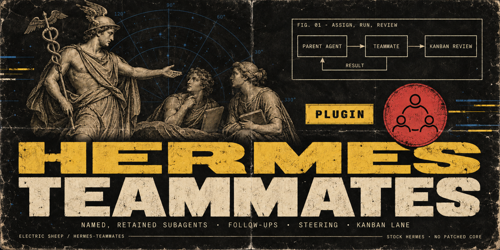
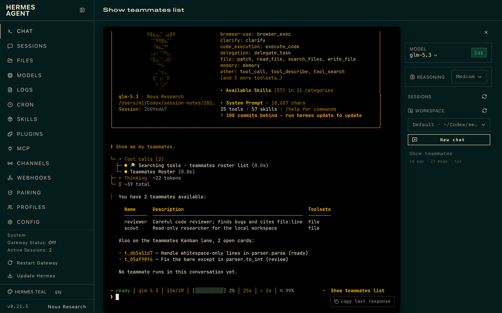
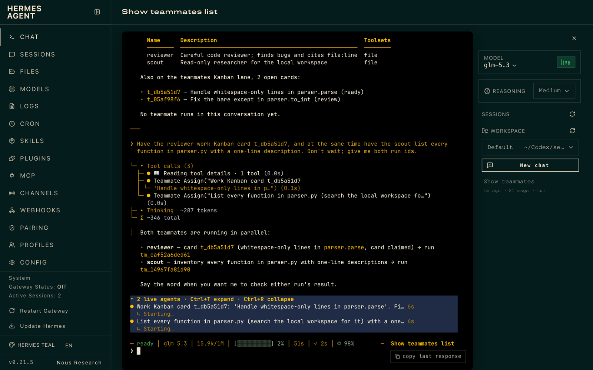
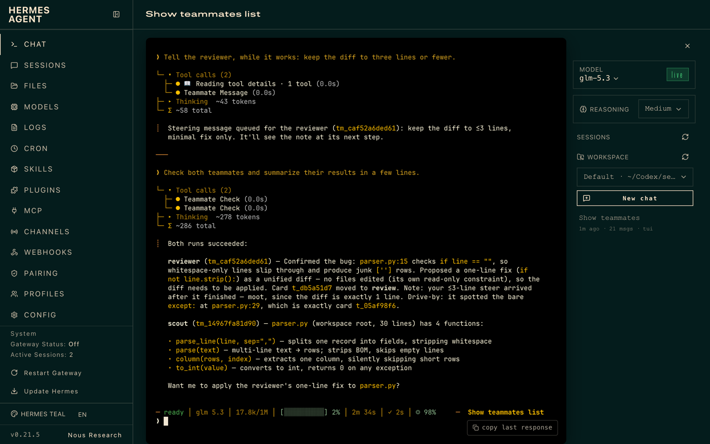
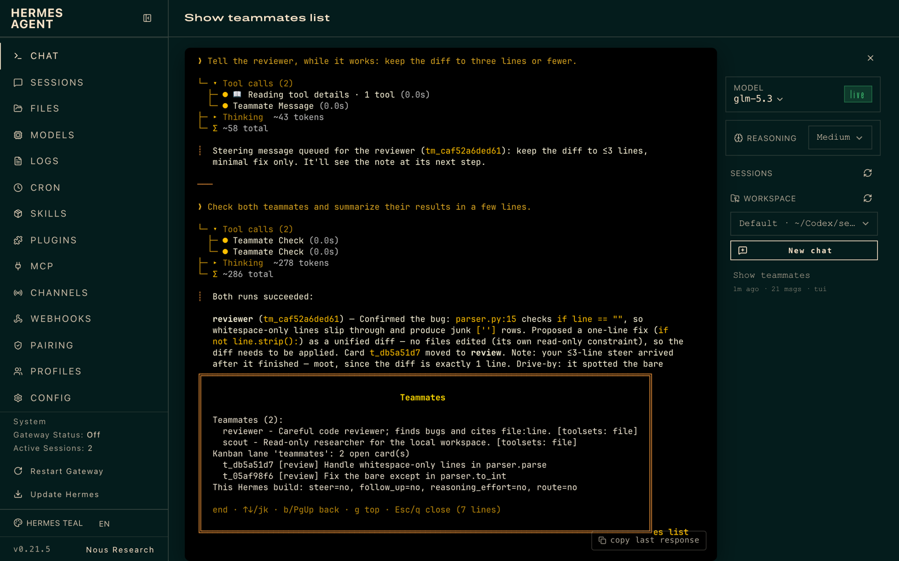

# Hermes Teammates



**Named, retained subagent teammates for [Hermes Agent](https://github.com/NousResearch/hermes-agent).**
You define a small roster of teammates (a reviewer, a scout, a test-writer), each with its own instructions,
toolsets and model. Your agent hands them work, checks on them, steers them mid-run, follows up with the context
of earlier assignments, and can work a Kanban lane with a review handoff.

Stock Hermes; no patched core. It uses the public plugin subagent lifecycle API (`ctx.subagent_lifecycle`).

- **For:** people who already delegate with Hermes and want the same specialists every time, without rewriting
  the brief, and with a durable record of what each teammate did.
- **Not for:** DAG workflows with gates and fan-out. Use
  [hermes-workflows](https://github.com/jacobhausler/hermes-workflows) for those. Teammates is about who does the
  work; workflows is about the shape of a long job.

## Screenshots

| Roster | Two teammates in parallel, one working a Kanban card |
|---|---|
|  |  |
| **Results; the card moved to review** | **`/teammates` in any chat** |
|  |  |

## How it works

```
 you ──► parent agent ──teammate_assign──► teammate (Hermes subagent, your toolsets/model)
              ▲                                  │
              └──────────teammate_check◄─────────┘  result, provider/model, duration
              │
              └─teammate_assign(kanban_task)──► claim lane task ─► run ─► task moves to REVIEW
```

1. You define teammates in config. The model only ever picks a teammate **name**; you decide what that name
   means.
2. `teammate_assign` launches a subagent through `ctx.subagent_lifecycle` and returns a `run_id` at once. The
   teammate's instructions travel in its context. Its toolsets can only narrow the parent's, never widen them.
3. `teammate_check` reports status, or waits up to 60 s and returns the result. Every run is recorded in a
   per-profile SQLite ledger (`<HERMES_HOME>/plugin-data/hermes-teammates/data.db`).
4. `follow_up: true` gives the teammate a bounded digest of its earlier assignments in this conversation, so it
   picks up where it left off.
5. `teammate_message` steers a running teammate. The text lands at its next step, without stopping it.
   `teammate_stop` cancels it.
6. **Kanban teammates lane.** Assign cards to the `teammates` lane, which is not a Hermes profile, so the
   dispatcher leaves them alone. `teammate_assign(kanban_task=…)` claims the card and keeps the claim alive while
   the teammate works. On success the card moves to **review** with the teammate's summary; on failure it is
   **blocked** with the reason. You, or your agent, accept or request changes with the usual Kanban tools.

## Install

```bash
hermes plugins install 100yenadmin/hermes-teammates --enable
```

Then restart the gateway (or the CLI session) so the tools register.

## Configure

`config.yaml`:

```yaml
plugins:
  entries:
    hermes-teammates:
      settings:
        teammates:
          reviewer:
            description: "Careful code reviewer; finds regressions and cites file:line."
            instructions: "Review the change you are given. Report findings with file:line and a fix."
            toolsets: [file, terminal]
          scout:
            description: "Fast read-only researcher."
            instructions: "Find the facts asked for. Quote sources. Do not edit files."
            toolsets: [web, file]
            model: null            # same provider as the parent; see Compatibility
        lane: teammates            # Kanban assignee for the teammates lane (must not be a profile name)
        max_live_runs: 4           # per conversation
        followup_context_chars: 8000
        claim_ttl_seconds: 900
```

Settings are read on every call, so edits apply without a restart.

## Use

Ask in plain language:

> Have the reviewer check the diff in `src/parser.py`, and the scout find how other projects handle BOM-prefixed
> CSV. Report back when both are done.

| Tool | What it does |
|---|---|
| `teammates_roster` | Lists teammates, this conversation's recent runs, open lane cards, and what this Hermes build supports |
| `teammate_assign` | Starts a run: `teammate`, `goal`, optional `context`, `follow_up`, `kanban_task` |
| `teammate_check` | Shows status, or waits (`wait_seconds` ≤ 60) for the result |
| `teammate_message` | Steers a running teammate |
| `teammate_stop` | Cancels a run |

`/teammates` prints the roster in any chat surface.

## Compatibility

- Requires Hermes **0.21.4 or newer**. CI runs against a pinned upstream commit and against `main`.
- Runs with `plugins.isolation: in_process` (the default). Under `plugins.isolation: host`, current Hermes builds
  cannot carry a subagent launch across the plugin-host boundary, so every tool except the roster answers
  `unsupported_isolation` instead of failing in an odd way.
- Some features depend on the Hermes build. The plugin detects each one at call time and never quietly
  substitutes something else:

| Teammate setting / feature | Needs in Hermes | When missing |
|---|---|---|
| `model` | any supported version | Must be served by the parent's provider |
| `route` (another provider) | a lifecycle route field (proposed upstream) | Reported as `unsupported_by_host`; the run uses the parent's provider |
| `reasoning_effort` | `SubagentLaunchRequest.reasoning_effort` (upstream PR #89936) | Reported as `unsupported_by_host` |
| steering | a lifecycle `steer`; today it goes through `delegate_task` steer with the live parent (in-process) | `teammate_message` returns `unsupported` |
| follow-up on the same child | a lifecycle `follow_up` (proposed upstream) | Follow-ups carry earlier results as context |

The upstream proposal is tracked in <ISSUE LINK>.

## Limits (honest list)

- **Follow-ups carry context, not the transcript.** A follow-up starts a fresh subagent with a digest of earlier
  results until Hermes exposes transcript-level follow-up to plugins.
- **Runs do not survive a restart.** Hermes keeps subagents in-process. After a restart the ledger marks
  unfinished runs `interrupted` and never re-runs them. A lane card's claim then expires through Kanban's normal
  TTL.
- **Runs belong to the conversation that started them.** Another chat on the same profile cannot see, steer or
  stop them.
- **A context compression starts a new conversation segment.** Hermes gives the conversation a new session id when
  it compresses, and runs belong to the segment that started them. Earlier runs then answer `unknown_run`. A lane
  card a run had claimed is released by the claim TTL.
- **Toolsets narrow, but they are Hermes toolsets.** `file` includes write tools, so a teammate with `file` can
  edit files even if its instructions say not to. Pick toolsets for what the teammate may do, not what it should
  do.
- Admission (spawn pause, depth limit) is Hermes's call. The plugin adds only a per-conversation cap on live runs.

## How to test

```bash
hermes plugins validate --install-deps ./hermes-teammates
cd hermes-teammates && python -m pytest -q   # inside a Hermes venv
```

Manual walkthrough (5 minutes):
1. Add the `reviewer` teammate above and restart.
2. Ask: "Show me my teammates." You should see the roster with `reviewer` and a features table.
3. Ask: "Have the reviewer summarize README.md in three bullets." You get a `run_id`, then the result via
   `teammate_check`.
4. Ask: "Follow up with the reviewer: which bullet is weakest?" The run starts with `follow_up: true`.
5. Create a Kanban card assigned to `teammates`, then ask: "Have the reviewer work Kanban task <id>." The card
   goes running → review with the summary.

## Security

See [SECURITY.md](SECURITY.md). In short:

- Teammates run with the parent's credentials and can only narrow toolsets.
- The model picks names, never providers or models.
- The ledger stays local and per profile.
- The plugin makes no network calls of its own.
- It only claims Kanban cards assigned to its lane.

## License

MIT. Maintained by [@100yenadmin](https://github.com/100yenadmin) (Electric Sheep).
